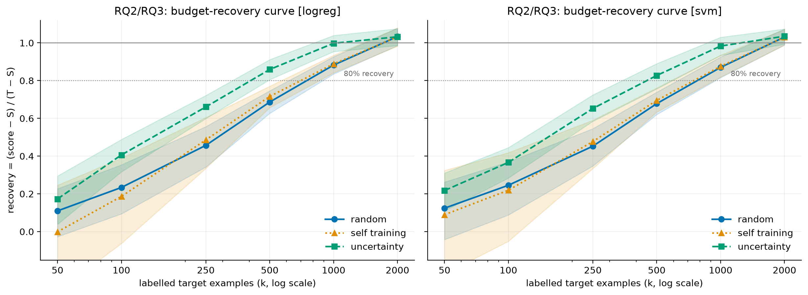
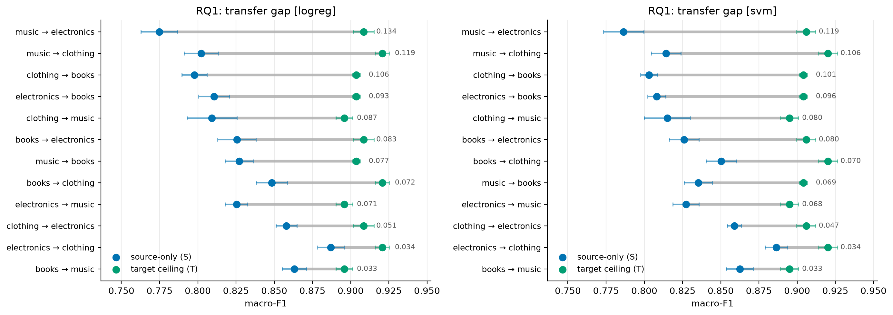
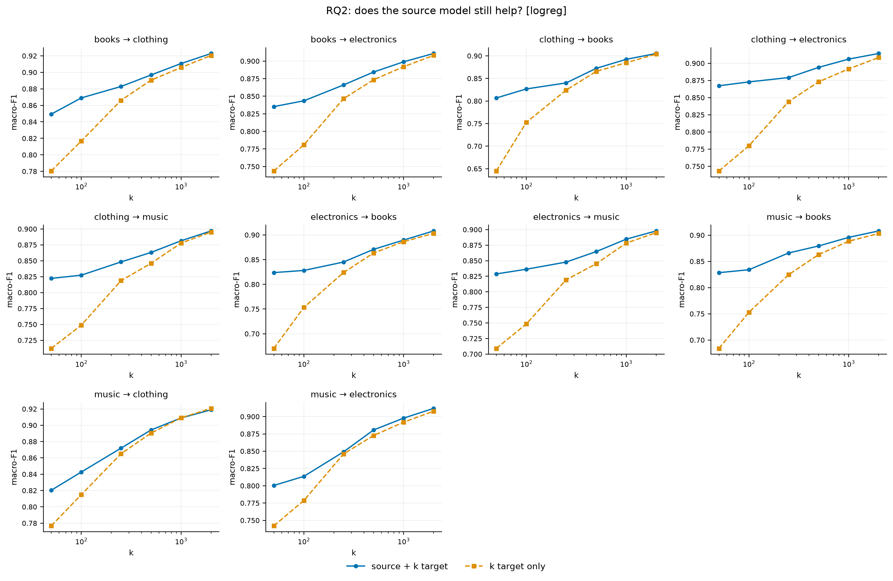
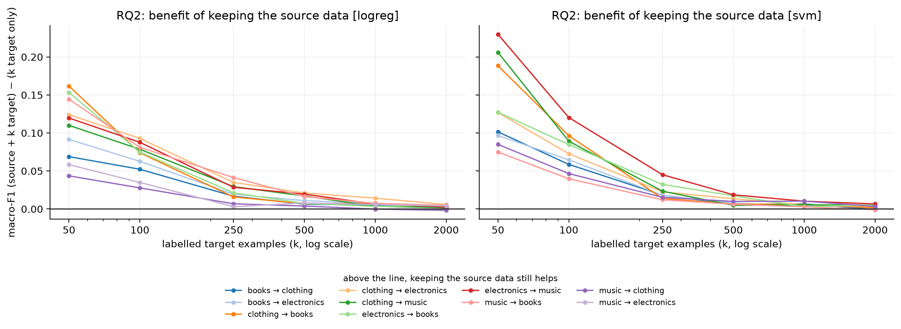

# Results

Generated by `tsa.runner`, then turned into tables and figures by
`tsa.analyze` and `tsa.plots`. The full written interpretation, including which
findings survived replication and how to word them, is in
[`../RESULTS_SUMMARY.md`](../RESULTS_SUMMARY.md).

Report **Run C** (`main_results.csv`): five resampled splits, one per seed, so
its intervals include split variance. Runs A and B used a single fixed
partition and are kept as independent robustness checks.

## Headline

Recovery of the transfer gap at each annotation budget, averaged over domain
pairs ([`analysis/headline.csv`](analysis/headline.csv)):

| classifier | strategy | k=50 | k=250 | k=1000 | k=2000 | budget to 80% |
|---|---|---|---|---|---|---|
| logreg | random | 0.173 | 0.486 | 0.877 | 1.026 | 768 |
| logreg | uncertainty | 0.237 | 0.660 | 0.982 | 1.026 | **422** |
| logreg | self-training | 0.126 | 0.526 | 0.878 | 1.022 | 741 |
| svm | random | 0.165 | 0.470 | 0.869 | 1.025 | 787 |
| svm | uncertainty | 0.228 | 0.637 | 0.965 | 1.025 | **459** |
| svm | self-training | 0.191 | 0.505 | 0.870 | 1.021 | 772 |

Uncertainty sampling reaches 80% recovery on roughly **half the labels** that
random sampling needs, for both classifiers.

## Figures

### Recovery curves by strategy


The headline figure: the separation between uncertainty and random sampling is
visible without reading a number off it.

### Transfer gap by domain pair


Shows the gap asymmetry directly. `music -> electronics` at 0.134 sits well
above `electronics -> music` at 0.071, the same two domains in reverse.

### Source-plus-target against target-only


Drives the crossover analysis in
[`analysis/rq2_crossover.csv`](analysis/rq2_crossover.csv).

### Benefit of the source model as budget grows


The benefit decays from about 0.16 macro-F1 at k=50 to under 0.005 at k=2000:
the source model is worth roughly 15 points at 50 labels and nothing at 2000.

## Tables

| Question | Files |
|---|---|
| RQ1 transfer gap | [`analysis/rq1_reference_lines.csv`](analysis/rq1_reference_lines.csv) |
| RQ2 budget and crossover | [`analysis/rq2_budget_to_recover.csv`](analysis/rq2_budget_to_recover.csv), [`analysis/rq2_crossover.csv`](analysis/rq2_crossover.csv), [`analysis/rq2_recovery_curves.csv`](analysis/rq2_recovery_curves.csv) |
| RQ3 strategy comparison | [`analysis/rq3_strategy_comparison.csv`](analysis/rq3_strategy_comparison.csv) |
| RQ4 domain distance | [`analysis/rq4_domain_distance.csv`](analysis/rq4_domain_distance.csv), [`analysis/rq4_corr_gap.csv`](analysis/rq4_corr_gap.csv), [`analysis/rq4_corr_budget.csv`](analysis/rq4_corr_budget.csv), [`analysis/rq4_decomposition.csv`](analysis/rq4_decomposition.csv) |

## Raw grids

One row per fitted model. `main_results.csv` is Run C; `main_results_prefix.csv`
and `main_results_split_b.csv` are Runs A and B;
`main_source_val_results.csv` is Run D, the `tuning: source_val` sensitivity
check. `pilot_*` and `gapcheck*` are the short diagnostic grids.

The corpora are not committed (see [`../data/README.md`](../data/README.md)),
but everything above regenerates from these CSVs alone:

```bash
python -m tsa.analyze --results results/main_results.csv
python -m tsa.plots   --results results/main_results.csv
```
